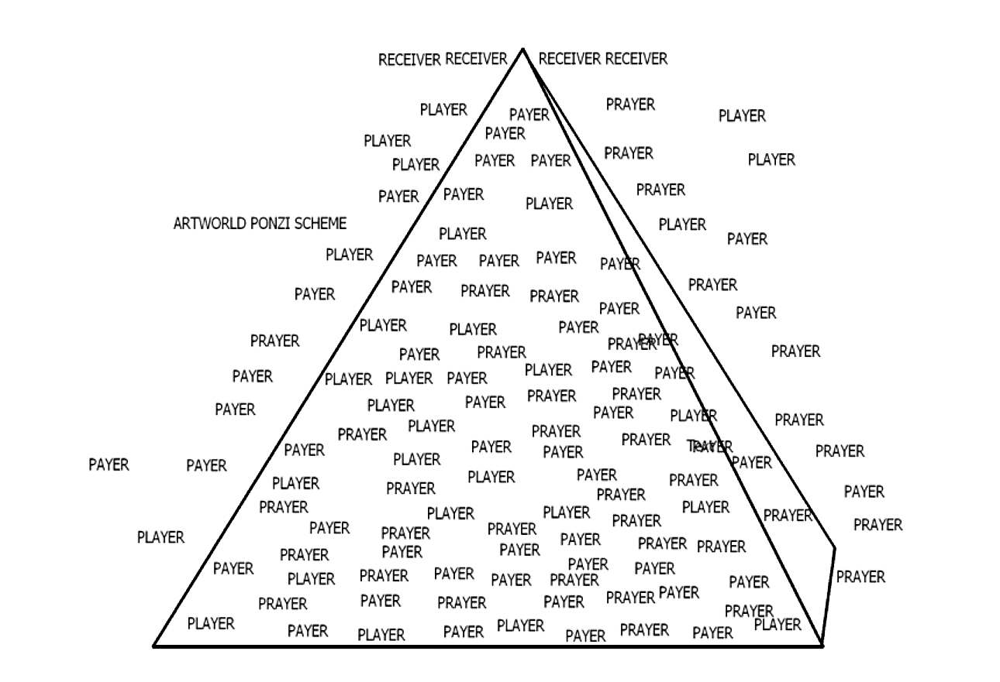

#The Agency of Art in the Unconscious 
###Marc James Léger

How can we explain the gray zone, the minimum distance between
creativity and capitalist demand? How can we understand creative
autonomy and resistance in the context of renewed expectations for art
to have a direct social and political utility? What can psychoanalysis
contribute to art criticism as it relates to the field of politicized
visual art, now more commonly referred to as socially engaged art? What
does the notion of the *avant-garde* mean for cultural production in a
world of networked connectivity, participatory ideology and creative
industry dispossession? According to Slavoj Žižek, when art production
is increasingly subjected to commodification, and when commodities are
increasingly aestheticized, artworks are no longer able to sustain the
lack in the *big Other*, understood here as the agency of belief in
art’s social and cultural significance.[^1] One symptom of this
phenomenon is the view that art today has collapsed directly into
political economy. In the words of the editors of *e-flux* journal,
‘contemporary art *is* neoliberalism in its most purified form’.[^2] The
truth of this assertion is that artworks are particularly apt as
signifiers of castration. As creativity marks ever more aspects of daily
life, almost any kind of work not only can, but in a kind of frenetic
hysteria, must be elevated to the place of Art.[^3] While this may seem
a standard postmodern argument for the breakdown of the distinction
between high art and mass culture, postmodernism tends nevertheless to
leave belief in the aesthetic intact, proliferating through the fields
of discourse it comes into contact with. In the following, I argue
against postmodern relativism, however, and wish to consider instead, to
paraphrase Žižek in his thinking on Christianity, ‘the perverse core’ of
avant-garde art production.

## Art for Imbeciles

In an essay on what he calls ‘enclave theory’, John Roberts made the
somewhat startling assertion that many of the most progressive art
theories of recent years (those attributed to Nicolas Bourriaud, Gregory
Sholette, Grant Kester, Stephen Wright, and even theorists like Jean-Luc
Nancy, Alain Badiou, Slavoj Žižek, Bruno Bosteels, Felix Guattari, Toni
Negri, and Michael Hardt) represent the ‘invariant core of a communist
programme’ that is ‘largely divorced from the past’, in particular, from
its Stalinist Communist party organizations, and is committed rather to
‘culturally aestheticized \[…\] autonomous forms of productive,
intellectual and creative community’.[^4] What is surprising in this
claim is the idea that these are invariant forms, and not significantly
different. Roberts asks us to consider what all of these theorists’
perspectives on radical culture have in common rather than what
distinguishes them. This gesture might not be such a bad way to
understand the so-called ‘crisis’ of art and art criticism in a world of
cultural corporatization and neoliberal engineering of creative capital.
Whatever contemporary art’s failings in terms of pursuing revolutionary
class struggle, it represents, according to Roberts, a kind of leftist
bloc against what Sholette terms enterprise culture. Perhaps one of the
most acerbic depictions of the art world as a rigged system of economic
and social exploitation is Bruce Barber’s 2008 drawing titled *Artworld
Ponzi Scheme*, which shows a pyramid comprized of payers, prayers, and
players, all of them trapped within a hierarchically inegalitarian
system. The intrigue in this drawing, especially as it comes after the
biggest financial debacle since the 1970s, is that the currency of art
is premised on false claims, or even ‘toxic assets’.  

Fig. Bruce Barber, *Artworld Ponzi Scheme*, drawing, 2008. Courtesy of
the artist.

The idea that art has no socially agreed upon justifications has been
addressed by anthropologist David Graeber, who wonders why contemporary
theorists attending an art symposium at the Tate Museum should explain
the 2008 fiasco by taking recourse to avant-garde art created between
1916 and 1922.[^5] His point is that we are potentially once again
living a revolutionary moment, but that epistemological subversion
through culture and post-structuralist theory seems to satisfy only
liberal academics. The return to avant-gardism, he argues, effects

> a subtle form of conservatism—or, perhaps one should say conservative radicalism, if such were possible—a nostalgia for the days when it was possible to put on a tin-foil suit, shout nonsense verse, and watch staid bourgeois audiences turn into outraged lynch mobs.

These days are gone, he argues, replaced by the immaterial labor and
service economy analysis of people like Maurizio Lazzarato and Toni
Negri. The art of the rich, he goes on, has more to do with the analysis
of products than of social processes, floating above the mire of
ordinary existence. Art today appears to contemporary political
philosophers to belong to the immaterial domain, a fact that exacerbates
its condition of crisis. The art world, for Graeber, is the apparatus of
people who manage this crisis. Unable to define the category of art in
any way that is adequate beyond its quality as something that only rich
people and museums can afford to buy, the art world cannot establish its
own legitimacy. Graeber then argues that the essence of politics in
social life is to make people believe. Things become true if you can
convince enough people to believe them. In order to play the game
effectively, one must not oneself know the essence of things. He
concludes from this that if the art world was to recognize itself as a
form of politics, it would also need to ‘recognize itself as something
both magical, and a confidence game—a kind of scam’.[^6] Insofar as
the art world has become an appendage to financial capital, fictive
capital explains fictive cultural value as well. All the players, he
argues, cynics and idealists alike, draw on outmoded nineteenth-century
notions of art, even those who create ‘enclaves’ where they can
experiment with new forms of life.

Where Graeber gets at the issue is when he later argues that for all of
the fictionalization that takes place across the social field, the
magically created value of art is no less real. This assertion confirms
the Lacanian emphasis on the reality of illusion, which contrasts to
transgressions that merely try to escape the Real. In this regard, Žižek
agrees with Badiou, who argues that art is a medium of truth. This also
relates to the Marxist understanding of commodity fetishism, which
states that even if capitalists understand that workers produce the
value of their merchandize, they nevertheless continue to believe in the
miracle of exchange. The famous Žižekian example, of course, is the
anecdote about Niels Bohr, who when asked if he believed in the good
luck derived from a horse shoe, replied he did not, but that apparently
it works even if one does not believe in it. Rather than payer, player,
and prayer, then, categories that Barber leaves undefined, I would like
to propose the set of three subject positions that Žižek outlines at the
start of *Less Than Nothing*: the idiot, the moron, and the
imbecile.[^7] All three positions are premized on the Lacanian theory of
the *big Other*, which stands for the heterogeneous social rules that
together comprize what Lacan defines as the social symbolic. As an
impersonal social agency, the *big Other* stands in for those rules that
shape the unconscious of the social subject.

The first of the three is the idiot, defined by Žižek as someone who is
‘too intelligent to process implicit social rules’.[^8] The idiot
imagines himself beyond the influence of the *big Other* and knows the
rules (of art) all too well to be able to process them in a way beyond
his hyper-intellectuality. As the first of two examples of idiots within
contemporary art theory, both colleagues of mine, we have Sholette and
his concept of ‘dark matter’. According to Sholette, dark matter
describes the ‘shadowy social productivity’ that haunts the high art
world. The great many excluded practices and failed artists who keep the
world of galleries, collections, and magazines going, Sholette argues,
are today threatening this pyramidal system as their dark energy becomes
increasingly visible. The book *Dark Matter* thus presents itself as a
‘lumpenography’ of this invisible mass of makeshift, amateur, informal,
unofficial, autonomous, activist, non-institutional, and self-organized
practices.[^9] Sholette argues that art critics, art historians, arts
administrators, collectors and dealers typically have little interest in
creative dark matter. There is no question that the art world is made up
not only of what is known about art, but involves a complex division of
labor and specialized tasks that work to keep a multi-billion-dollar
industry operating for the benefit of a minority of high profile
artists. This system keeps the vast majority of professionally trained
artists in a state of subservience and underdevelopment. The first and
most general question that is asked by Sholette is what would happen if
this superfluous majority went on permanent strike and gave up on the
art system’s means of legitimation. Contemporary high art is thoroughly
connected, he says, to Art Inc. and does not hide its profit
motivations. It is only those dark practices at the margins that still
hold on to this former (avant-garde) task of art to challenge commercial
goals. While Sholette does appreciate the labor theory of value, he
suspends the understanding that most forms of culture are non-productive
and rather dependent in complex ways on profits collected elsewhere in
the proletarianized global marketplace. Bourdieu’s sociology of art, in
contrast, benefited from its use of the concept of social totality. The
absence of the use of the concept of totality in Sholette’s book
prevents him from offering a class analysis of culture that would go
beyond redistributive justice. Also, dark matter seems to share very
little common ground with the avant-garde tradition of revolutionary
art, whose distinct purpose is to represent the social function of art
in class society. As Žižek has argued, an ideological identification
exerts the greatest pressure on us when we fool ourselves into believing
we are not fully identical to it. The epistemological crisis in the arts
that is mentioned in Sholette’s introduction to *Dark Matter* should
therefore not be thought to directly reflect the crisis in global
capital, though the connections between these spheres do indeed need to
be drawn.

A second idiot in this set is Brian Holmes and his theory of ‘liar’s
poker’. Holmes is one of the sharpest analysts of artistic resistance
within societies of control and is also, like so many contemporary
theorists, skeptical of avant-garde modes of contestation. Within the
new flexible regimes of accumulation and casual freelance culture, the
demands for autonomy, he argues, are diverted into new modes of
control.[^10] The premise of liar’s poker, as he puts it, is that ‘when
people talk about politics in an artistic frame, they’re lying’.[^11]
Cultural institutions, he argues, constantly demand that artists
‘picture politics’, playing the art game and representing those who are
excluded to those who are safely nestled inside, especially
transnational corporations, who then support the realm of art as a
sphere that is separate from abstract financial decisions. Anti-art
artists who work directly in the public sphere or on the terrain of
everyday life, or within new technological and scientific landscapes,
only pretend to leave behind the artistic frame. In reality they collude
with curators and directors to show images of political reality. Because
the latter are averse to such realism, the artist has to bluff their way
through. Holmes assumes, however, that an artist involved with a social
movement is an artist that has successfully challenged the guilt
relations of the art system. Because of this he is deeply suspicious of
the function of belief, which, he argues, is a powerful or interesting
fetish, an illusion that gets players caught in the game rather than
directly confronting power, as in the case of artworks that deepen the
links between art activism and social movements. What distinguishes
Holmes from Žižek, however, is that he does not ask us to believe even
more in art and to directly assume the lack in the *big Other*—a small
distinction, but a crucial one if we are to see art institutions as
anything more than duplicitous. Like Sholette, Holmes is concerned that
institutions seek cultural capital among ‘the more radical fractions of
the artistic field’.[^12] The artist has to produce the ace of politics,
he argues, while proving all the while that the ace is merely a joker,
thereby undermining the reality of the illusion. Like so many leftists,
Holmes assumes that the big Other is or can be occupied.

The second subject position outlined by Žižek is the moron, defined by
‘the stupidity of those who fully identify with common sense, who fully
stand for the big Other of appearances’.[^13] Two notable cultural
theorists who might in some ways fill this description are Grant Kester
and Claire Bishop. Kester is a seasoned art critic with a long track
record of insightful writing on the shift from public art and identity
politics in the 1980s and 90s to the new phenomenon of community art in
the 90s and 2000s. The type of site-specific collaborative work that he
champions unfolds, he says, through an extended interaction with local
communities. Like many proponents of the new tendencies, he has worked
to anchor his theory of ‘dialogical aesthetics’ in both social and
political history as well as the philosophy of aesthetics. While erudite
and knowledgeable, Kester’s polemic, as presented in his book *The One
and the Many*, is intensely prescriptive.[^14] For the sake of artist
groups like Park Fiction, Ala Plastica, and Dialogue, all avant-garde
tactics (reduced to formalist modernism) are proscribed, including the
work of leading cultural theorists like Barthes, Derrida, de Certeau,
Lyotard, Kristeva, Blanchot, Badiou, Deleuze and Guattari, Agamben,
Nancy, Levinas, and Rancière—anyone associated with the post-May 68
generation of postmodern pessimism and who programmatically guard
against premature totalizations.

> We are witnessing today a certain disenchantment with the existing parameters of avant-garde art and an attempt to rearticulate the specificity of the aesthetic in relationship to both the viewer and to other cultural and political practices.[^15]

The leitmotif of avant-garde and theoretical post-structuralism, he
argues, is the impossibility of social cohesion.[^16] In contrast,
Kester is interested in the global phenomenon and success of
collaborative modes of production, as found for instance in the work of
Border Arts Workshop, Group Material, REPOhistory, Gran Fury, Platform,
WochenKlausur, and Groupo Etcetera, where emphasis is placed on multiple
authorship, participatory relation to audience, and process-based
activist intervention.[^17] Despite his critique of what he calls the
‘intellectual baroque’, Kester’s dialogical aesthetics retains many of
the typical leitmotifs of postmodernism, especially the distinctions
that are made between pluralism and an older avant-garde notion of
culture that retained some links to the class politics of socialism.
With globalization, I would argue, social forms have channeled culture
in such a way as to give it a privileged role in economic development.
According to George Yúdice, culture is today treated as an expedient,
construed as a resource for sociopolitical ameliorism and job creation,
a process that coincides with capitalist ideology and biopolitical
regulation.[^18] The role of culture, Yúdice argues, ‘has expanded in an
unprecedented way into the political and economic at the same time that
conventional notions of culture have been emptied out’.[^19] Unlike
Sholette and Holmes, Kester tends to underplay this problem of
institutional mediation, leaving actually existing institutions all the
more operative in the administration of socially engaged art.

Another critic we could add to the group of morons is Claire Bishop.
Bishop is well-known for her 2004 *October* essay in which she
criticized Bourriaud’s relational aesthetics for its rhetoric of
democracy and emancipation.[^20] The open works advocated by
contemporary critics like Bourriaud foreground interaction rather than
contemplation and engagement rather than passivity and disengagement,
assuming that these former modalities are inherently political and
emancipatory. She argues that Bourriaud wants to equate aesthetic
judgement with political judgement. ‘But how’, she asks, ‘do we measure
or compare these relationships?’.[^21] Dialogue, she says, is assumed in
advance to be democratic, excluding other modalities, like autonomy,
antagonism, oppositionality, destabilization, and artworks that
recognize the limits of ‘society’s ability to fully constitute
itself’.[^22] She defines the autonomy of the artwork in terms of the
social antagonism that is mirrored in the tension between art and
society. Bishop insists that we should be better able to judge art
itself and not merely better politics, and therefore acknowledge the
limits of what art can do. One of the problems here is the return to the
function of criticism and the assumption that art, by itself, can be the
object of objective assessment. In this gesture Bishop obviates the
notion of antagonism that she otherwise recognizes. While she exposes
what is repressed in the idea of social harmony, she ignores how art
itself acts as this agent of repression. In this regard, *Artificial
Hells*, her latest treatment of participatory art, mostly expands the
number of examples rather than improve the initial theory.[^23] She
worries about the instrumentalization of participatory art, something
Kester is less troubled by, but perhaps misses the point that this
apprehension is misplaced insofar as it concerns itself with art *per
se* and art criticism as a means of institutional legitimation (perhaps
to satisfy critics like Graeber). She very correctly recognizes that the
new European cultural policies enacted under *New Labour* in the U.K.
are a form of social engineering but fails to produce a theory that
addresses how and why art eludes such institutionalization.

I would argue, in contrast, that it is quite possible for an artwork to
be valid as an autonomous and critical work and at the same time to defy
institutional capture, and this, without denying the incompleteness of
the social. For me to say this, I should think that I belong to the
third group in Žižek’s series: the imbeciles. An imbecile is someone
whose mental retardation causes him to be aware of the need for a *big
Other*, but who does not rely on it. The imbecile is somewhere between
the idiot and the moron, who recognizes the function of language but who
distrusts it.[^24] The *big Other* exists, but is inconsistent. The
question for aesthetics, then, is to consider in theoretical and not
only sociological terms the ways in which the art world guarantees the
consistency of the rules of art, allowing for dark matter to be
distinguished from consecrated artists. What unites the idiot, the moron
and the imbecile is the inconsistency of their belief in the *big Other*
of art and, as I argue further on, this inconsistency represents the
‘perverse core’ of aesthetics as such.

## The Reality of the Fiction

What is the significance of critical art in the context of contemporary
cultural theory, within the space of culture in general, and as it is
being reengineered to conform ever more tightly with the needs of
accumulation—leading many to presume that avant-garde artworks and
films have been made obsolete by new social relations and by the new
regimes of production? Here I would like to pursue the path of the
imbecile with reference to Žižek’s chapter on Christianity in the
opening ‘Drink Before’ section of *Less Than Nothing*. The trick is to
not reduce theory to empiricism and to focus on the negative energy of
art rather than the positivity of the social causes that artists are
being increasingly expected to deal with directly. While I do not agree
with those who argue that art and reparative social work or political
propaganda are inherently separate activities, I do think that socially
engaged art benefits from some aesthetic theorizing that goes beyond
German idealism.

Žižek’s attention to Hegel in *Less Than Nothing* is largely due to the
overlap with Lacan and Žižek’s view that among the German idealists,
Hegel alone is able to sustain the idea of the lack in the *big Other*
and the dialectical reversal that occurs when an epistemological
obstacle is transposed directly into the Thing itself—here the work of
art.[^25] ‘Our inability to know the thing indicates a crack in the
thing itself, so that our very failure to reach the full truth is the
indicator of truth.’[^26] No wonder then that dark matter, to take up
the metaphor, is obviated by the obsession with the celebrity star
system: Picasso, Van Gogh, Ai Weiwei, Gerhard Richter, Jeff Koons, what
have you. One problem in the structure of ideology, Žižek explains, is
that there is no public, no symbolic agency that is there to register or
witness the disasters of capitalism. What is missing is the *big Other*,
the space of symbolic inscription and ideological suture. In contrast to
Claire Bishop’s quest to determine institutional criteria for judging
participatory art, Žižek writes:

> Schoenberg still hoped that somewhere there would be at least one listener who would truly understand his atonal music. It was only his greatest pupil, Anton Webern, who accepted the fact that there is no listener, no big Other to receive the work and properly recognize its value.[^27]

There are no guarantees for art and this becomes one of the principal
axioms of the notion of creativity. Those who worry that all creativity
is today harnessed by capital miss an important point: the form of
illusory appearance remains on the surface of things and is thus closer
to the Real than historical reality itself. The concern of political
moralists and reformists is often to escape from the Real of illusion
through some kind of transgression that seeks to show the true,
so-called ‘phenomenal’ reality, usually by pointing to some token of
reality: bodily affect, group interaction, S&P indicators, the haptic
qualities of new media, etc. The idea that art criticism should be more
global in scope, representing a greater diversity of experiences, is one
way among many to avoid the Real of illusion.[^28] What then can
artworks tell us about the changing parameters of what Peter Bürger
defined as the ‘institution art’?[^29]

The unique quality of art is that more than most other things in our
social universe it can express the reality of illusion through any
random object. This illusory quality is a secret, in Marx the commodity
fetish, or in Lacan, the ineffable *objet a* that allows anything to be
elevated to the concept of Art and allows it to be installed in the
symbolic order. The artist comes closest to this understanding when he
or she intervenes through the neutral position of the analyst.[^30] The
artist’s neutrality cannot be socially localized since the art thing has
no ontological reality but is a virtual point. This is what Lacan refers
to in the notion of *le père ou le pire*—the oedipal father or the
worse, the choice of art as the worse option, which more effectively
undermines the entire symbolic field. Avant-garde works represent a
negative force against the organic unity of community and as such are
vital to emancipatory politics.[^31] Strict egalitarian emancipation
cancels rather than preserves the organic unity of the hierarchical
social order. Radical art operates as the obscene disavowed underside of
the art world ponzi scheme. How so?

Almost every artwork preserves some aspect of the idea of art as a
reserve, or background against which we can measure deviations. Art’s
non-art status is therefore inscribed into the idea of Art—something
that Duchamp was perhaps the first artist to expound. Art is deeply
atheistic, to put things in terms of belief, and perversion is at the
core of the aesthetic. The obsession with the ineffable *big Other* is
sublated into acts of creation, something that Lacan defines as drive.
Creativity can therefore be defined as the eruption of a new form that
reorganizes the social field, imposing itself as a new necessity through
an act of ungrounded subjective decision, abandoned by Art and with no
guarantee of aesthetic value or art world consecration.[^32] The
inscrutability of the aesthetic *big Other*, even as blue chip
investment, is the certitude of creativity, the condition of its
ecstatic production. Since art is dead and the author is dead and since
therefore the function of the critic is nullified, art making and art
judgments are sacrificed to a pure Otherness of subjective destitution.

Art making is a scandal that undermines art from within. Such work has a
tragic self-effacing quality that socially engaged art sometimes refuses
in its resentment and narcissistic hatred of the ‘no’ of Art. It
denounces art in favor of ethics but it does so through the disavowal of
the love of art. It proffers the socially networked artist as the better
of the avant-garde artist but it is the latter who properly betrays the
extorsion of creativity. The revolutionary artist acts unconditionally
and therefore comes closest to art’s expression of freedom and
emancipation, insisting, much like Antigone, on symbolic demand. The
creative artist is consequently excluded from the community of humans.

Holmes’ notion of ‘liar’s poker’ can be explained as the insistence on
aesthetic sublimation rather than the insistence on the refusal of
co-optation; it implies an awareness of the monstrosity of the game
since the game is not only fixed in the symbolic order, but more
radically, since through his or her act the artist believes in the game
more than s/he is aware. The artist acts as though he or she is not
aware of capitalist recuperation, observing the appearances, the
virtuality of the illusion of the real. In the case of Barber’s pyramid,
the ‘prayer’ in the set represents a transitive function; he or she does
not have to believe since belief is presupposed by the artwork as
virtual entity. No wonder then that so many artists today are attempting
to go beyond the making of objects, taking social interaction itself as
the direct instantiation of art. This becomes possible due to the
perverse core of art and is an indication of the transitivity of belief.
The paradox, however, is that if we take away whatever stands in for
belief, we lose the reality of the illusion and so any claim to
emancipation through the community of believers is equally annulled. The
function of the art world, therefore—critics, museums, magazines, even
this essay—is to maintain appearances, in particular, against any
agency or Master who would pretend to know everything. The master artist
is the person who possesses an almost God-like ability to both make art
and to simultaneously prohibit the making of art. This prohibition takes
the form in capitalist society of symbolic castration through surplus
value. A provisional definition of the avant-garde artist can therefore
be the condition of the acceptance of the inexistence of aesthetic
criteria. There are no guarantees for the social importance of artworks,
only the passage from creativity to consequences. For things to happen,
creation must be a condition of the truth of illusion.

### References

Aranda, Julieta, Brian Kuan Wood and Anton Vidokle (eds). ‘Editorial’,
*e-flux journal 21* (2010),
http://www.e-flux.com/journal/editorial-18/.

Bishop, Claire. ‘Antagonism and Relational Aesthetics’, *October 110*
(2004): 51-79.

Bishop, Claire. *Artificial Hells: Participatory Art and the Politics of
Spectatorship*, London: Verso, 2012.

Bürger, Peter. *Theory of the Avant-Garde*, trans. Michael Shaw,
Minneapolis: University of Minnesota Press, 1984.

Graeber, David. ‘“The Sadness of Post-Workerism”, or, “Art and
Immaterial Labour” Conference: A Sort of Review’, 2008,
http://www.scribd.com/doc/38093582/The-Sadness-of-Post-Workerism-David-Graeber.

Holmes, Brian. *Unleashing the Collective Phantoms: Essays in Reverse
Imagineering*, Brooklyn: Autonomedia, 2008.

Kester, Grant. *The One and the Many: Contemporary Collaborative Art in
a Global Context*, Durham: Duke University Press, 2011.

Léger, Marc James. ‘Art and Art History After Globalization’, *Third
Text* 26:5 (2012): 515-527.

Léger, Marc James. ‘The Subject Supposed to Over-Identify: BAVO and the
Fundamental Fantasy of a Cultural Avant Garde’, in Léger (ed.) *Brave
New Avant Garde: Essays on Contemporary Art and Politics*, Winchester,
UK: Zero Books, 2012.

Raunig, Gerald, Gene Ray and Ulf Wuggenig (eds). *Critique of
Creativity: Precarity, Subjectivity and Resistance in the ‘Creative
Industries’*, London: MayFly Books, 2011.

Roberts, John. ‘Art, “Enclave Theory” and the Communist Imaginary’,
*Third Text* 23:4 (2009): 353-367.

Sholette, Gregory. *Dark Matter: Art and Politics in the Age of
Enterprise Culture*, London: Pluto, 2011.

Yúdice, George. *The Expediency of Culture: Uses of Culture in the
Global Era*, Durham: Duke University Press, 2003.

Žižek, Slavoj. *The Fragile Absolute, or, Why Is the Christian Legacy
Worth Fighting For?,* London: Verso, 2000.

Žižek, Slavoj. *Less than Nothing: Hegel and the Shadow of Dialectical
Materialism*, London: Verso, 2012.

[^1]: Slavoj Žižek, *The Fragile Absolute, or, Why Is the Christian
    Legacy Worth Fighting For?*, London: Verso, 2000, pp. 31-32.

[^2]: Julieta Aranda, Brian Kuan Wood and Anton Vidokle (eds),
    ‘Editorial’, *e-flux journal* 21 (2010),
    http://www.e-flux.com/journal/editorial-18/.

[^3]: See Gerald Raunig, Gene Ray and Ulf Wuggenig (eds), *Critique of
    Creativity: Precarity, Subjectivity and Resistance in the ‘Creative
    Industries’*, London: MayFly Books, 2011.

[^4]: John Roberts, ‘Art, “Enclave Theory” and the Communist Imaginary’,
    *Third Text* 23:4 (2009): 353, 358.

[^5]: David Graeber, ‘“The Sadness of Post-Workerism”, or “Art and
    Immaterial Labour” Conference: A Sort of Review’, 2008,
    http://www.scribd.com/doc/38093582/The-Sadness-of-Post-Workerism-David-Graeber.

[^6]: Graeber, ‘“The Sadness of Post-Workerism”’.

[^7]: Slavoj Žižek, *Less than Nothing: Hegel and the Shadow of
    Dialectical Materialism*, London: Verso, 2012, pp. 1-2.

[^8]: Žižek, *Less than Nothing*, p. 1.

[^9]: Gregory Sholette, *Dark Matter: Art and Politics in the Age of
    Enterprise Culture*, London: Pluto, 2011, p. 1.

[^10]: Brian Holmes, *Unleashing the Collective Phantoms: Essays in
    Reverse Imagineering*, Brooklyn: Autonomedia, 2008, p. 19.

[^11]: Holmes, *Unleashing the Collective Phantoms*, p. 81.

[^12]: Holmes, *Unleashing the Collective Phantoms*, p. 91.

[^13]: Žižek, *Less than Nothing*, p. 1.

[^14]: Grant Kester, *The One and the Many: Contemporary Collaborative
    Art in a Global Context*, Durham: Duke University Press, 2011.

[^15]: Kester, *The One and the Many*, pp. 36-37.

[^16]: Kester, *The One and the Many*, p. 49.

[^17]: Kester, *The One and the Many*, p. 4.

[^18]: George Yúdice, *The Expediency of Culture: Uses of Culture in the
    Global Era*, Durham: Duke University Press, 2003.

[^19]: Yúdice, *The Expediency of Culture*, p. 9.

[^20]: Claire Bishop, ‘Antagonism and Relational Aesthetics’, *October*
    110 (2004): 51-79.

[^21]: Bishop, ‘Antagonism and Relational Aesthetics’: 65.

[^22]: Bishop, ‘Antagonism and Relational Aesthetics’: 67.

[^23]: Claire Bishop, *Artificial Hells: Participatory Art and the
    Politics of Spectatorship*, London: Verso, 2012.

[^24]: Žižek, *Less than Nothing*, p. 2.

[^25]: Žižek, *Less than Nothing*, p. 17.
[^26]: Žižek, *Less than Nothing*, p. 17.
[^27]: Žižek, *Less than Nothing*, p. 29.
[^28]: Marc James Léger, ‘Art and Art History After Globalization’,
    *Third Text* 26:5 (2012): 515-527.
[^29]: Peter Bürger, *Theory of the Avant-Garde*, trans. Michael Shaw,
    Minneapolis: University of Minnesota Press, 1984.
[^30]: Marc James Léger, ‘The Subject Supposed to Over-Identify: BAVO
    and the Fundamental Fantasy of a Cultural Avant Garde’, in Léger
    (ed.), *Brave New Avant Garde: Essays on Contemporary Art and
    Politics*, Winchester, UK: Zero Books, 2012.
[^31]: Žižek, *Less than Nothing*, p. 70.
[^32]: Žižek, *Less than Nothing*, pp. 106-11.
